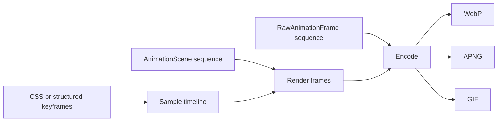

# Animation

The animation API supports two models: sampling CSS or structured keyframes at a
specific time, and encoding a sequence of scenes or raw frames.



## Timeline sampling

`time_ms` selects the instant at which CSS animation or structured keyframes are
sampled:

```python
from takumi_py import Renderer

frame = Renderer().render_node(
    {"type": "container", "className": "box"},
    stylesheets=[
        ".box { width: 64px; height: 64px; animation: fade 1000ms both; }",
    ],
    keyframes={
        "fade": {
            "from": {"opacity": 0},
            "to": {"opacity": 1},
        }
    },
    width=64,
    height=64,
    time_ms=500,
)
```

## Scene sequences

`render_animation` accepts a sequence of `AnimationScene` values. The `format`
argument selects WebP, APNG, or GIF, while `fps` controls timeline sampling:

```python
from takumi_py import AnimationScene, Renderer

animation = Renderer().render_animation(
    [
        AnimationScene(
            {
                "type": "container",
                "style": {
                    "width": "100%",
                    "height": "100%",
                    "backgroundColor": "black",
                },
            },
            duration_ms=200,
        ),
        AnimationScene(
            {
                "type": "container",
                "style": {
                    "width": "100%",
                    "height": "100%",
                    "backgroundColor": "white",
                },
            },
            duration_ms=200,
        ),
    ],
    width=64,
    height=64,
    fps=20,
    format="webp",
)
```

Use `encode_frames` with `RawAnimationFrame` when frames are produced elsewhere.

Every `AnimationScene.duration_ms` and `RawAnimationFrame.duration_ms` value must be a
positive integer. Zero-duration scenes or frames raise `ValueError` rather than being
silently skipped.

`fps` must be positive and must not exceed the delay precision of the selected
format: WebP and APNG support at most 90 fps, while GIF supports at most 50 fps.
`webp_speed`, when provided, must be an integer from 0 through 6. A raw frame must
have positive dimensions and exactly `width * height * 4` RGBA bytes.

!!! note "WebP defaults to lossless"

    WebP animation defaults to lossless when neither `quality` nor `lossless` is
    specified. `quality` and `lossless=True` are mutually exclusive.

See the complete runnable
[`examples/render_animation.py`](https://github.com/BalconyJH/takumi-py/blob/main/examples/render_animation.py)
example.
