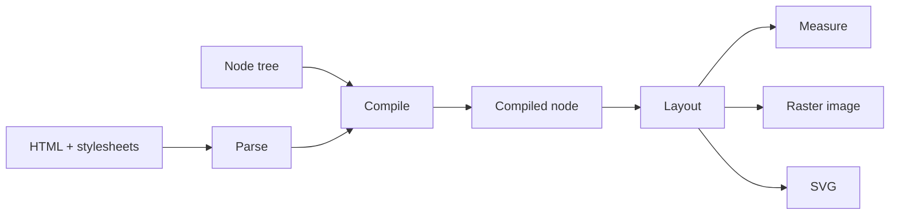

# Rendering model

`Renderer` follows one pipeline regardless of the source representation:



## Input layer

`Renderer` accepts two primary input models: a structured node tree and HTML.

=== "Node tree"

    ```python
    from takumi_py import Renderer

    png = Renderer().render_node(
        {
            "type": "container",
            "style": {
                "width": "320px",
                "height": "160px",
                "backgroundColor": "white",
            },
            "children": [{"type": "text", "text": "Hello"}],
        },
        width=320,
        height=160,
    )
    ```

=== "HTML"

    ```python
    from takumi_py import Renderer

    png = Renderer().render_html(
        '<div class="card">Hello</div>',
        stylesheets=[
            ".card { width: 320px; height: 160px; color: black; }",
        ],
        width=320,
        height=160,
    )
    ```

Takumi's Rust parser handles HTML. Inline `style` attributes are part of the HTML;
document-level CSS must be passed explicitly through `stylesheets`. Use `HtmlOptions`
to control Chromium presets, the Tailwind attribute name, and maximum parse depth.

## Compile and reuse

For one render, call `render_node` or `render_html` directly. When the same content is
rendered repeatedly, move parsing and stylesheet compilation out of the hot path:

```python
from takumi_py import Renderer

renderer = Renderer()
compiled = renderer.compile_node(
    {"type": "text", "text": "Reusable"},
)
png = renderer.render_compiled(compiled, width=320, height=160)
```

`compile_html` returns a `CompiledHtml` bundle rather than a bare `CompiledNode`.
Pass its node and compiled stylesheets separately to the compiled APIs, and compile
any document-level CSS before adding it to that stylesheet tuple:

```python
from takumi_py import Renderer

renderer = Renderer()
compiled = renderer.compile_html('<div class="card">Reusable HTML</div>')
stylesheets = (
    *compiled.stylesheets,
    renderer.compile_stylesheet(
        ".card { width: 320px; height: 160px; color: black; }"
    ),
)

png = renderer.render_compiled(
    compiled.node,
    stylesheets=stylesheets,
    width=320,
    height=160,
)
```

Do not pass the `CompiledHtml` wrapper itself to `render_compiled` or
`measure_compiled`; those methods accept `CompiledNode`.

!!! note "Discovery is not fetching"

    `CompiledNode.resource_urls()` discovers HTTP(S) image references but never makes
    a request. Fetch and validate those resources in the application, construct
    `ImageResource` values, and pass the bytes into the render call.

## Viewport and measurement

The default viewport is 1200×630. Pass `width=None` or `height=None` to infer that
dimension from layout. When only layout data is needed, call `measure_node`,
`measure_html`, or `measure_compiled` instead of producing an image.

```python
measured = Renderer().measure_node(
    {
        "type": "container",
        "style": {"width": "240px", "height": "120px"},
    },
    width=None,
    height=None,
)
```

## Output formats

| Output | API family | Result |
| --- | --- | --- |
| PNG, JPEG, WebP, ICO | `render_*` | Encoded `bytes` |
| Raw RGBA | `render_*` with the raw format | Pixel `bytes` |
| SVG | `render_svg_*` | `str` |
| Layout only | `measure_*` | `MeasuredNode` |

Device pixel ratio, quality, lossless mode, dithering, and debug borders can be
passed directly or grouped in `RenderOptions`.

!!! warning "Do not specify contradictory output options"

    Explicit keyword arguments override corresponding `RenderOptions` fields, but
    the binding still rejects invalid combinations such as lossy quality together
    with `lossless=True`.

## Common parameter boundaries

The native boundary validates values before rendering:

| Parameter | Contract |
| --- | --- |
| `width`, `height` | `None` for layout inference, otherwise a positive integer |
| `font_size` | Finite number greater than zero |
| `device_pixel_ratio` | Finite number greater than zero |
| `time_ms` | Non-negative integer |
| render-level `lang` | `None` or a valid BCP-47 language tag |
| `quality` | Integer from 0 through 100 |
| `lossless` | Supported only for WebP; `lossless=True` cannot be combined with `quality` |

Invalid numeric values and contradictory encoder options raise `ValueError`. Format
names rejected by the binding raise the corresponding public format or animation
exception described in the [exception reference](../reference/exceptions.md).
