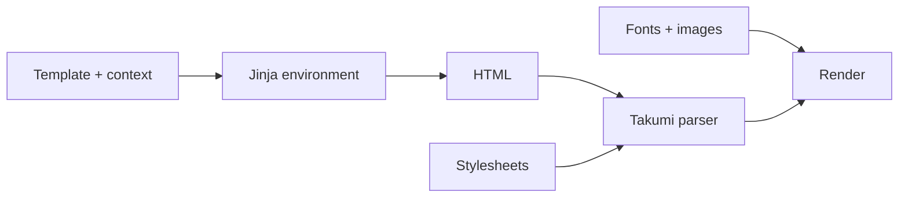

# Jinja templates

`TemplateRenderer` owns a filesystem-backed Jinja environment and sends rendered HTML
to the Takumi parser.

```python
from takumi_py import Renderer, TemplateRenderer


def uppercase(value: str) -> str:
    return value.upper()


configured_renderer = Renderer()
renderer = TemplateRenderer(
    "templates",
    filters={"uppercase": uppercase},
    renderer=configured_renderer,
)

png = renderer.render(
    "card.html.jinja",
    {"title": "takumi-py"},
    stylesheets=[
        ".card { width: 1200px; height: 630px; color: white; background: #111827; }",
    ],
    width=1200,
    height=630,
)
```

The template can use `{{ title | uppercase }}` directly. The
`render_template_to_html` helper accepts the same `filters` mapping when the caller
needs an HTML string rather than image output.

## Inject a complete Jinja environment

The filesystem-backed environment is a convenience default, not a restricted Jinja
surface. Inject an existing `jinja2.Environment` when the application needs another
loader, globals, tests, extensions, an undefined-value policy, a bytecode cache, or
other native Jinja configuration:

```python
from jinja2 import Environment, PackageLoader, StrictUndefined, select_autoescape

from takumi_py import TemplateRenderer


environment = Environment(
    loader=PackageLoader("my_app", "templates"),
    autoescape=select_autoescape(("html", "xml", "jinja")),
    undefined=StrictUndefined,
)
environment.globals["product_name"] = "My App"
environment.tests["featured"] = lambda item: item.featured

renderer = TemplateRenderer(
    environment=environment,
    filters={"currency": lambda value: f"${value:,.2f}"},
)
```

`renderer.environment` is the exact injected instance. `filters` are updated on that
instance before the first template is loaded. `render_template_to_html` also accepts
`environment=...`. In both APIs, `template_dir` and `environment` are mutually
exclusive so that one template-loading source cannot silently shadow another.

## Inject a configured renderer

Pass an existing `Renderer` to `TemplateRenderer` when templates must share registered
fonts or other renderer-owned state. Configure the renderer first, then inject that
same instance:

```python
from pathlib import Path

from takumi_py import FontResource, Renderer, TemplateRenderer


def uppercase(value: str) -> str:
    return value.upper()


configured_renderer = Renderer(load_default_fonts=False)
families = configured_renderer.register_font(
    FontResource(
        Path("Inter-Regular.woff2").read_bytes(),
        name="Inter",
        generic_family="sans-serif",
    )
)
renderer = TemplateRenderer(
    "templates",
    filters={"uppercase": uppercase},
    renderer=configured_renderer,
)
png = renderer.render(
    "card.html.jinja",
    {"title": "takumi-py"},
    stylesheets=[".card { width: 1200px; height: 630px; }"],
    font_families=families,
    width=1200,
    height=630,
)
```

## Responsibility boundaries



- Configure filters, globals, tests, and extensions before the first render. Jinja does
  not guarantee predictable behavior when an environment is mutated after a template
  has already been loaded.
- Templates generate HTML. Supply images through render inputs. Register custom fonts
  on an injected renderer as shown above and follow the [resource guide](resources.md).
- Keep CSS in explicit `stylesheets` inputs so the template layer does not own render
  configuration.
- Jinja autoescape is enabled by default for HTML, XML, and Jinja files. A caller-owned
  environment retains its own autoescape policy.

!!! caution "Custom filters execute application code"

    Treat filter functions and template directories as trusted application inputs.
    Autoescape protects interpolated markup; it does not sandbox Python filter code.
