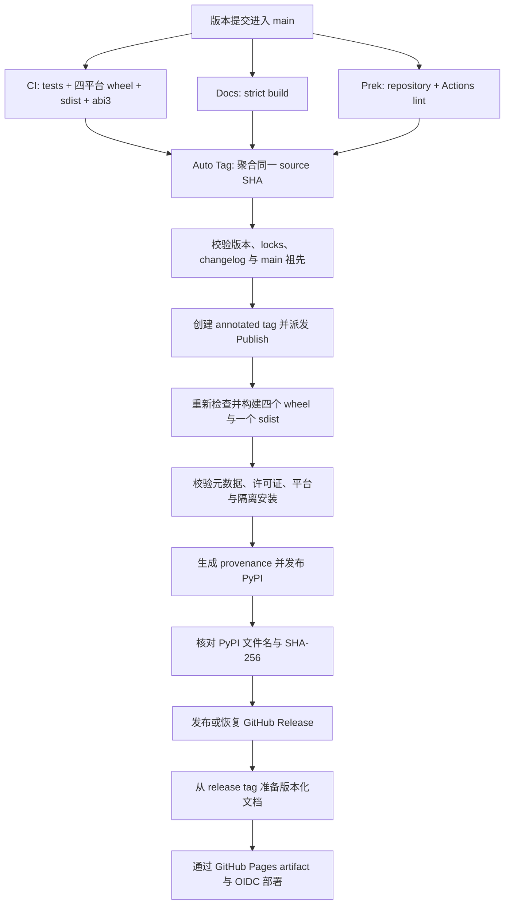

# 发布

正常发布由 `main` 上的版本变化驱动。维护者无需手工构建制品、创建标签或部署文档；
自动化只会处理同时满足版本契约和同一提交门禁的版本。

## 准备发布提交

发布提交必须同时满足以下契约：

- `pyproject.toml` 与根 `Cargo.toml` 的项目版本完全一致。
- 相对 `main` 第一父提交，项目版本严格递增，并使用规范的 PEP 440 表示。
- `uv.lock` 与 `Cargo.lock` 已更新且能通过 locked 检查。
- `CHANGELOG.md` 包含该版本的日期标题。
- `make check`、`make docs-build` 和全部 Prek hook 均通过。

使用项目工具更新版本，不要直接编辑版本字段：

```bash
uv version 0.3.0 --no-sync
cargo set-version 0.3.0
```

提交合并到 `main` 后，`CI`、`Docs`、`Prek` 会分别验证同一提交。`Auto Tag on
Version Change` 等待三个工作流全部成功，确认版本、锁文件、changelog 和 `main`
祖先关系后，为该提交创建 annotated `v0.3.0` 标签，并且仅派发一次 `Publish`。

!!! note "普通发布不再手工创建标签"

    自动标签是精确提交门禁的一部分。手工标签会跳过门禁聚合，只应用于管理员明确判断过的
    异常恢复；正常发布不要执行 `git tag` 或直接运行 `Publish`。

## 自动发布链路 { #automatic-release-pipeline }



发布构建包含 Linux x86_64、Linux aarch64、macOS arm64、Windows x64 四个
`cp310-abi3` wheel 和一个 sdist。验证层会：

1. 检查完整制品集合、包元数据、许可证、ABI/平台标签及内置字体边界。
2. 在仓库外的临时虚拟环境安装并执行渲染 smoke，避免意外导入 checkout。
3. 从 sdist 重新构建 wheel，并对重建结果执行同样的隔离 smoke。
4. 对最终上传文件生成 GitHub build provenance。
5. 通过 Trusted Publishing 上传 PyPI；重跑时允许跳过已存在文件，但随后必须与
   PyPI JSON 中的完整文件集合和 SHA-256 完全一致。
6. 仅在 PyPI 核验成功后发布 GitHub Release；现有已发布 Release 只允许摘要一致的
   幂等重跑，现有草稿可以用本次已验证制品恢复。
7. 从同一个 release tag 通过 mike 更新版本；只有不旧于现有最高版本的发布才能移动
   `latest`，并对作为版本状态存储的 `gh-pages` 并发写入进行有限重试。
8. 从更新后的 `gh-pages` 导出完整静态树，上传标准 `github-pages` artifact，并通过
   OIDC 部署到受保护的 `github-pages` environment。

本地检查发布物时使用：

```bash
make build-artifacts
```

该目标会构建当前平台 wheel 与 sdist、运行 Twine 元数据检查，并在隔离环境中验证
wheel 以及 sdist 重建路径。`DIST_SMOKE_PYTHON` 可指定 smoke 使用的 Python 版本。

## 外部仓库设置

仓库文件无法自行启用以下控制，管理员需在 GitHub 与 PyPI 配置：

- 保护 `main`，至少要求 `CI / Required checks`、`Docs / Build docs strictly` 和
  `Prek / Repository hooks`，并要求 release automation 的 code-owner review。
- 允许 GitHub Actions 的 `GITHUB_TOKEN` 按工作流声明获得写权限；若保护 release tag，
  为 `Auto Tag on Version Change` 配置受控 bypass。
- 在 `release` environment 配置 required reviewers。
- 将 PyPI Trusted Publisher 绑定到 owner `BalconyJH`、repository `takumi-py`、
  workflow `publish.yml` 和 environment `release`。
- 将 GitHub Pages Source 配置为 `GitHub Actions`，并让 `github-pages` environment
  只允许受信任的 `v*` release tag 部署。
- 启用 immutable GitHub Releases；工作流对已发布 Release 只做摘要核验，不会改写。
- 保留 Dependabot 的 GitHub Actions 周更，并让 SHA pin 更新通过相同门禁。

## 故障恢复

=== "门禁失败，尚未创建标签"

    修复问题并合并到 `main`。因为修复提交的版本可能与父提交相同，自动检测不会再次
    把它视为版本变化；此时从当前 `main` 手工运行 `Auto Tag on Version Change`，传入
    当前完整 40 位 `source_sha`。恢复模式只接受当前 `main` 且仍会要求三个精确提交
    工作流全部成功。

=== "标签存在，但 Publish 未成功"

    从匹配标签或默认分支手工运行 `Publish`，传入相同 `release_tag`。不要创建替代标签，
    也不要改写标签指向。

=== "PyPI 已经接收部分或全部文件"

    重跑同一标签的 `Publish`。上传步骤使用 `skip-existing`，之后的摘要核验会确认已存在
    文件是否就是本次构建结果；缺失文件会等待 PyPI 元数据收敛，摘要不同则立即失败。

=== "GitHub Release 或文档部署失败"

    再次运行同一标签的 `Publish`。已发布 Release 只有在文件集合与摘要完全一致时才被
    复用；草稿可从已验证制品恢复。文档准备会重新读取远端 `gh-pages` 并重试冲突，
    随后的 Pages deployment 会重新使用同一次运行上传的静态 artifact。

!!! danger "不要改写已经发布的制品"

    PyPI 文件、已发布 GitHub Release、release tag 都是不可变输入。任何摘要不一致都应
    停止发布并调查来源，而不是 force push、替换版本或覆盖已发布文件。
