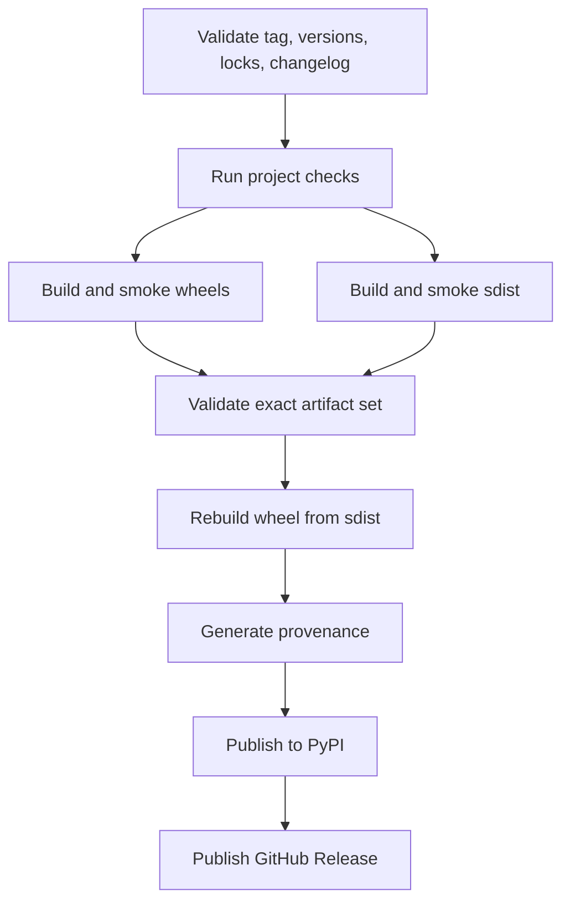

# Releasing

The GitHub Actions release workflow is tag-driven. A normal release never requires a
maintainer to upload wheels or a source distribution manually.

## Prepare the release commit

The release commit must satisfy every version contract:

- The Python project version in `pyproject.toml` matches the package version in
  `Cargo.toml`.
- `uv.lock` and `Cargo.lock` are current and pass locked checks.
- `CHANGELOG.md` contains a dated heading for the version.
- `make docs-build` succeeds from the release tree, and every added, moved, or removed
  page is reflected in `zensical.toml` navigation.
- The commit is on `main`, and all required CI checks passed.

Bump versions through project tooling:

```bash
uv version 0.3.0 --no-sync
cargo set-version 0.3.0
```

## Create the tag

After the release commit is visible on `main`, create a signed tag for that exact
commit. Do not combine the `main` push and tag push into one operation that depends on
server-side event ordering.

```bash
git tag -s v0.3.0 -m "takumi-py 0.3.0" <commit-on-main>
git push origin v0.3.0
```

## Release graph



The workflow validates the tag, `HEAD`, `main` ancestry, Python and Cargo versions,
lock files, and changelog before building. It then:

1. Builds four platform wheels and one sdist, with platform-specific smoke tests.
2. Validates the exact artifact set, metadata, licenses, ABI/platform tags, and default
   font boundary.
3. Rebuilds a wheel from the isolated sdist and runs another smoke test.
4. Generates provenance for the files that will actually be uploaded.
5. Publishes through PyPI Trusted Publishing.
6. Creates a draft GitHub Release, attaches the same artifacts, and publishes it only
   after PyPI succeeds.

## Publish documentation manually

Documentation deployment is a required manual release step until it is represented by
an explicitly approved workflow. After the GitHub Release succeeds, check out the
exact release tag, build the site, and deploy that version with the `latest` alias:

```bash
git switch --detach v0.3.0
make docs-build
uv run --group docs mike deploy --push --update-aliases 0.3.0 latest
uv run --group docs mike set-default --push latest
```

Verify the version selector, `latest` alias, and the published API reference at
`https://balconyjh.github.io/takumi-py/` before marking the release complete.

!!! danger "Deployment writes to the remote repository"

    The mike commands update `gh-pages`. Run them only from the exact release tag and
    only as an explicit maintainer release operation. An ordinary documentation build
    must never deploy implicitly.

!!! note "Artifacts are immutable inputs"

    The release workflow neither overwrites existing GitHub Release assets nor reuses
    build artifacts across separate workflow runs.

## External controls

Repository files cannot enforce these controls; an administrator must configure them:

- Protect `main`, require the CI jobs, and require code-owner review for release
  automation.
- Configure required reviewers on the `release` environment.
- Bind the PyPI Trusted Publisher to owner `BalconyJH`, repository `takumi-py`, workflow
  `publish.yml`, and environment `release`.
- Configure GitHub Pages to publish the `gh-pages` branch before the first versioned
  documentation deployment.
- Enable immutable GitHub Releases.

## Failure recovery

=== "Before PyPI"

    Fix the cause and rerun the same workflow run.

=== "After PyPI"

    If GitHub Release publication fails after PyPI succeeds, do not rebuild or replace
    PyPI files. Complete the GitHub Release with the same validated artifacts.

=== "Release already exists"

    The workflow fails instead of using `--clobber`. Investigate the origin and state
    of the existing release before making any remote change.
